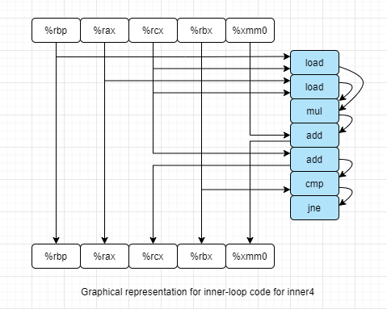

# 5 Optimizing Program Performance


## 5.13

- Problem

  > Suppose we wish to write a procedure that computes the inner product of two vectors u and v. An abstract version of the function has a CPE of 14–18 with x86-64 for different types of integer and floating-point data. By doing the same sort of transformations we did to transform the abstract program combine1 into the more efficient combine4, we get the following code:
  
  ```c
  /* Inner product. Accumulate in temporary */
  void inner4(vec_ptr u, vec_ptr v, data_t *dest)
  {
      long i;
      long length = vec_length(u);
      data_t *udata = get_vec_start(u);
      data_t *vdata = get_vec_start(v);
      data_t sum = (data_t) 0;
      
      for (i = 0; i < length; i++) {
          sum = sum + udata[i] * vdata[i];
      }
      *dest = sum;
  }
  ```
  
  > ​	Our measurements show that this function has CPEs of 1.50 for integer data and 3.00 for floating-point data. For data type double, the x86-64 assembly code for the inner loop is as follows:
  
  ```assembly
  # Inner loop of inner4. data_t = double, OP = *
  # udata in %rbp, vdata in %rax, sum in %xmm0
  # i in %rcx, limit in %rbx
  .L15: 									# loop:
  	vmovsd 	0(%rbp,%rcx,8), %xmm1		#	Get udata[i]
  	vmulsd 	(%rax,%rcx,8), %xmm1, %xmm1	#	Multiply by vdata[i]
  	vaddsd 	%xmm1, %xmm0, %xmm0			#	Add to sum
  	addq 	$1, %rcx					#	Increment i
  	cmpq	%rbx, %rcx					#	Compare i:limit
  	jne		.L15						#	If !=, goto loop
  ```
  
  > Assume that the functional units have the characteristics listed in Figure 5.12.
  >
  > A. Diagram how this instruction sequence would be decoded into operations and show how the data dependencies between them would create a critical path of operations, in the style of Figures 5.13 and 5.14.
  >
  > B. For data type double, what lower bound on the CPE is determined by the critical path?
  >
  > C. Assuming similar instruction sequences for the integer code as well, what lower bound on the CPE is determined by the critical path for integer data?
  >
  > D. Explain how the floating-point versions can have CPEs of 3.00, even though the multiplication operation requires 5 clock cycles.
  
- Solution

  > A.

   

  > B. The double add operation, CPE = 3.0

  > C. The integer add operation, CPE = 1.0

  > D. Because the critical path only have the add operation, mul operation is not belong to critical path.


## 5.14

- Problem

  > Write a version of the inner product procedure described in Problem 5.13 that uses 6 × 1 loop unrolling. For x86-64, our measurements of the unrolled version give a CPE of 1.07 for integer data but still 3.01 for both floating-point data.
  >
  > A. Explain why any (scalar) version of an inner product procedure running on an Intel Core i7 Haswell processor cannot achieve a CPE less than 1.00.
  >
  > B. Explain why the performance for floating-point data did not improve with loop unrolling.

- Solution

  ```c
  void inner4_unrolling6x1(vec_ptr u, vec_ptr v, data_t *dest)
  {
      long i;
      long length = vec_length(u);
      long limit = length - 6;
      data_t *udata = get_vec_start(u);
      data_t *vdata = get_vec_start(v);
      data_t sum = (data_t) 0;
      
      for (i = 0; i < limit; i += 6) {
          sum = sum + udata[i] * vdata[i];
          sum = sum + udata[i+1] * vdata[i+1];
          sum = sum + udata[i+2] * vdata[i+2];
          sum = sum + udata[i+3] * vdata[i+3];
          sum = sum + udata[i+4] * vdata[i+4];
          sum = sum + udata[i+5] * vdata[i+5];
      }
      
      for (; i < length; i++) {
          sum = sum + udata[i] * vdata[i];
      }
      *dest = sum;
  }
  ```

  > A. Because each loop have 6 add operation, so each element still have 1 add operation, so CPE can't be less than 1.0

  > B. The reason is same as A.