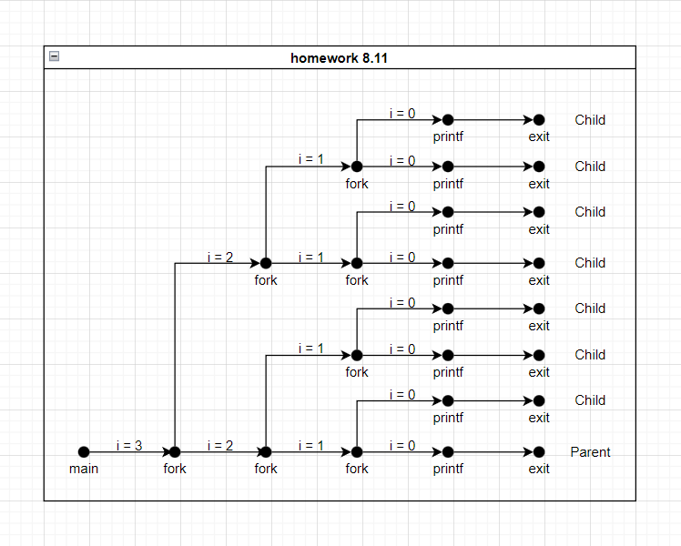
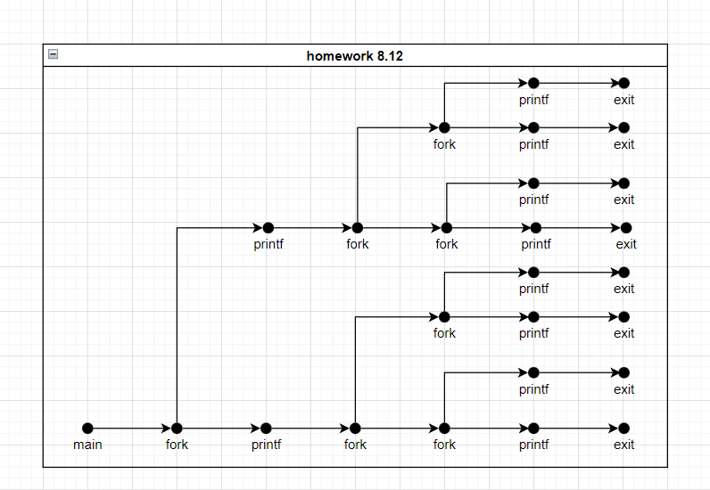
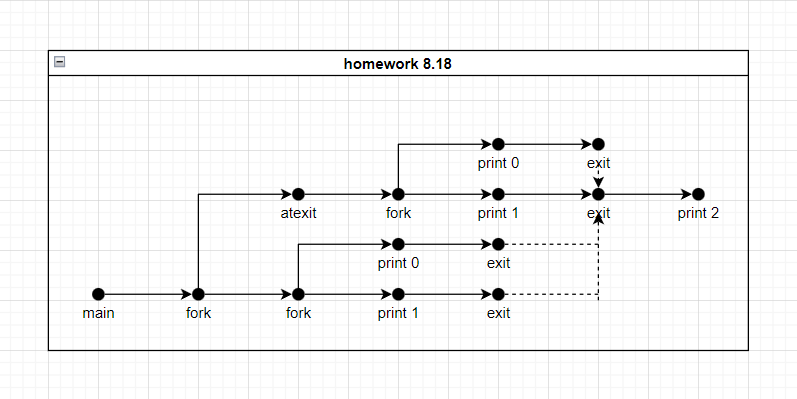

# 8 Exceptional Control Flow


## 8.9

- Problem

  > Consider four processes with the following starting and ending times:

  | Process | Start time | End time |
  | :-----: | :--------: | :------: |
  |    A    |     6      |    8     |
  |    B    |     3      |    5     |
  |    C    |     4      |    7     |
  |    D    |     2      |    9     |

  > For each pair of processes, indicate whether they run concurrently (Y) or not (N):

- Solution

  | Process pair | Concurrent? |
  | :----------: | :---------: |
  |      AB      |      N      |
  |      AC      |      Y      |
  |      AD      |      Y      |
  |      BC      |      Y      |
  |      BD      |      Y      |
  |      CD      |      Y      |

  

## 8.11

- Problem

  > How many “Example” output lines does this program print?

  ```c
  #include "csapp.h"
  
  int main()
  {
      int i;
      for (i = 3; i > 0; i--)
          Fork();
      printf("Example\n");
      exit(0);
  }
  ```

- Solution

  

  The answer is 8.

  

## 8.12

- Problem

  > How many “Example” output lines does this program print?

  ```c
  #include "csapp.h"
  
  void try()
  {
      Fork();
      printf("Example\n");
      Fork();
      return;
  }
  
  int main()
  {
      try(); Fork();
      printf("Example\n");
      exit(0);
  }
  ```

- Solution

  

  The answer is 10.

  

## 8.16

- Problem

  > What is the output of the following program?

  ```c
  #include "csapp.h"
  int counter = 1;
  
  int main()
  {
      if (fork() == 0) {
          counter++;
          exit(0);
      }
      else {
          Wait(NULL);
          counter++; printf("counter = %d\n", counter);
      }
      exit(0);
  }
  ```

- Solution

  

  The answer is "counter = 2"(the counter in child is different from the counter in parent process).


## 8.18

- Problem

  > Consider the following program:

  ```c
  #include "csapp.h"
  
  void end(void)
  {
      printf("2"); fflush(stdout);
  }
  
  int main()
  {
      if (Fork() == 0)
          atexit(end);
      if (Fork() == 0) {
          printf("0"); fflush(stdout);
      }
      else {
          printf("1"); fflush(stdout);
      }
      exit(0);
  }
  ```

  > Determine which of the following outputs are possible. Note: The atexit function takes a pointer to a function and adds it to a list of functions (initially empty) that will be called when the exit function is called.
  >
  > A. 112002
  > B. 211020
  > C. 102120
  > D. 122001
  > E. 100212

- Solution

  

  The answer is ACE.

  

## 8.21

- Problem

  > What are the possible output sequences from the following program?

  ```c
  int main()
  {
      printf("p"); fflush(stdout);
      if (fork() != 0) {
          printf("q"); fflush(stdout);
          return 0;
      }
      else {
          printf("r"); fflush(stdout);
          waitpid(-1, NULL, 0);
      }
      return 0;
  }
  ```

- Solution

  
  
  "pqr" or "prq".
  
  

## 8.25

- Problem

  > Write a version of the fgets function, called tfgets, that times out after 5 seconds. The tfgets function accepts the same inputs as fgets. If the user doesn’t type an input line within 5 seconds, tfgets returns NULL. Otherwise, it returns a pointer to the input line.

- Solution

  ```c
  #include <setjmp.h>
  #include <signal.h>
  #include <stdio.h>
  #include <unistd.h>
  
  sigjmp_buf buf;
  
  char *tfgets(char *str, int n, FILE *stream);
  
  int main()
  {
      char s[100];
  
      if (tfgets(s, 100, stdin)) {
          printf("return val %s\n", s);
      } else {
          printf("return val NULL\n");
      }
  
      return 0;
  }
  
  void sigalrm_handler(int signum) {
      siglongjmp(buf, 1);
  }
  
  char *tfgets(char *str, int n, FILE *stream)
  {
      if (!sigsetjmp(buf, 1)) {
          signal(SIGALRM, sigalrm_handler);
          alarm(5);
          fgets(str, n, stream);
      } else {
          str = NULL;
          return NULL;
      }
  }
  ```
  
  