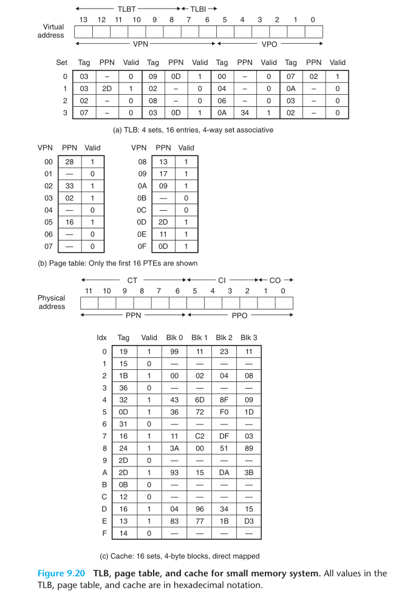

# 9 Virtual Memory


> Example memory system in Section 9.6.4:
>
> - The memory is byte addressable.
> - Memory accesses are to 1-byte words (not 4-byte words).
> - Virtual addresses are 14 bits wide (n = 14).
> - Physical addresses are 12 bits wide (m = 12).
> - The page size is 64 bytes (P = 64).
> - The TLB is 4-way set associative with 16 total entries.
> - The L1 d-cache is physically addressed and direct mapped, with a 4-byte line size and 16 total sets.




## 9.11

- Problem

  > In the following series of problems, you are to show how the example memory system in Section 9.6.4 translates a virtual address into a physical address and accesses the cache. For the given virtual address, indicate the TLB entry accessed, the physical address, and the cache byte value returned. Indicate whether the TLB misses, whether a page fault occurs, and whether a cache miss occurs. If there is a cache miss, enter “—” for “Cache byte returned.” If there is a page fault, enter “—” for “PPN” and leave parts C and D blank.
  >
  > Virtual address: 0x027c

- Solution

  > A. Virtual address format

  |  13  |  12  |  11  |  10  |  9   |  8   |  7   |  6   |  5   |  4   |  3   |  2   |  1   |  0   |
  | :--: | :--: | :--: | :--: | :--: | :--: | :--: | :--: | :--: | :--: | :--: | :--: | :--: | :--: |
  |  0   |  0   |  0   |  0   |  1   |  0   |  0   |  1   |  1   |  1   |  1   |  1   |  0   |  0   |

  > B. Address translation

  | Parameter         | Value |
  | ----------------- | ----- |
  | VPN               | 0x09  |
  | TLB index         | 0x1   |
  | TLB tag           | 0x02  |
  | TLB hit? (Y/N)    | N     |
  | Page fault? (Y/N) | N     |
  | PPN               | 0x17  |

  > C. Physical address format

  |  11  |  10  |  9   |  8   |  7   |  6   |  5   |  4   |  3   |  2   |  1   |  0   |
  | :--: | :--: | :--: | :--: | :--: | :--: | :--: | :--: | :--: | :--: | :--: | :--: |
  |  0   |  1   |  0   |  1   |  1   |  1   |  1   |  1   |  1   |  1   |  0   |  0   |

  > D. Physical memory reference

  | Parameter           | Value |
  | ------------------- | ----- |
  | Byte offset         | 0x0   |
  | Cache index         | 0xf   |
  | Cache tag           | 0x17  |
  | Cache hit? (Y/N)    | N     |
  | Cache byte returned | —     |

  

## 9.12

- Problem

  > Repeat Problem 9.11 for the following address.
  >
  > Virtual address: 0x03a9

- Solution

  > A. Virtual address format

  |  13  |  12  |  11  |  10  |  9   |  8   |  7   |  6   |  5   |  4   |  3   |  2   |  1   |  0   |
  | :--: | :--: | :--: | :--: | :--: | :--: | :--: | :--: | :--: | :--: | :--: | :--: | :--: | :--: |
  |  0   |  0   |  0   |  0   |  1   |  1   |  1   |  0   |  1   |  0   |  1   |  0   |  0   |  1   |

  > B. Address translation

  | Parameter         | Value |
  | ----------------- | ----- |
  | VPN               | 0x0e  |
  | TLB index         | 0x2   |
  | TLB tag           | 0x03  |
  | TLB hit? (Y/N)    | N     |
  | Page fault? (Y/N) | N     |
  | PPN               | 0x11  |

  > C. Physical address format

  |  11  |  10  |  9   |  8   |  7   |  6   |  5   |  4   |  3   |  2   |  1   |  0   |
  | :--: | :--: | :--: | :--: | :--: | :--: | :--: | :--: | :--: | :--: | :--: | :--: |
  |  0   |  1   |  0   |  0   |  0   |  1   |  1   |  0   |  1   |  0   |  0   |  1   |

  > D. Physical memory reference

  | Parameter           | Value |
  | ------------------- | ----- |
  | Byte offset         | 0x1   |
  | Cache index         | 0xa   |
  | Cache tag           | 0x11  |
  | Cache hit? (Y/N)    | N     |
  | Cache byte returned | —     |

  

## 9.13

- Problem

  > Repeat Problem 9.11 for the following address.
  >
  > Virtual address: 0x0040

- Solution

  > A. Virtual address format

  |  13  |  12  |  11  |  10  |  9   |  8   |  7   |  6   |  5   |  4   |  3   |  2   |  1   |  0   |
  | :--: | :--: | :--: | :--: | :--: | :--: | :--: | :--: | :--: | :--: | :--: | :--: | :--: | :--: |
  |  0   |  0   |  0   |  0   |  0   |  0   |  0   |  1   |  0   |  0   |  0   |  0   |  0   |  0   |

  > B. Address translation

  | Parameter         | Value |
  | ----------------- | ----- |
  | VPN               | 0x01  |
  | TLB index         | 0x1   |
  | TLB tag           | 0x00  |
  | TLB hit? (Y/N)    | N     |
  | Page fault? (Y/N) | Y     |
  | PPN               | —     |

  > C. Physical address format

  |  11  |  10  |  9   |  8   |  7   |  6   |  5   |  4   |  3   |  2   |  1   |  0   |
  | :--: | :--: | :--: | :--: | :--: | :--: | :--: | :--: | :--: | :--: | :--: | :--: |
  |      |      |      |      |      |      |      |      |      |      |      |      |

  > D. Physical memory reference

  | Parameter           | Value |
  | ------------------- | ----- |
  | Byte offset         |       |
  | Cache index         |       |
  | Cache tag           |       |
  | Cache hit? (Y/N)    |       |
  | Cache byte returned |       |

  

## 9.14

- Problem

  > Given an input file hello.txt that consists of the string Hello, world!\n, write a C program that uses mmap to change the contents of hello.txt to Jello, world!\n.

- Solution

  ```c
  #include <stdlib.h>
  #include <sys/mman.h>
  #include <fcntl.h>
  
  int main()
  {
      int fd;
      char *bufp; /* ptr to memory-mapped VM area */
  
      fd = open("hello.txt", O_RDWR, 0);
      bufp = mmap(NULL, 1, PROT_WRITE, MAP_SHARED, fd, 0);
      bufp[0] = 'J';
  
      return 0;
  }
  ```


## 9.15

- Problem

  > Determine the block sizes and header values that would result from the following sequence of malloc requests. Assumptions: 
  >
  > (1) The allocator maintains double-word alignment and uses an implicit free list with the block format from Figure 9.35. 
  >
  > (2) Block sizes are rounded up to the nearest multiple of 8 bytes.

  

- Solution

  | Request(word) | Block size (decimal bytes) | Block header (hex) |
  | ------------- | -------------------------- | ------------------ |
  | malloc(4)     | 16                         | 0x00000011         |
  | malloc(7)     | 32                         | 0x00000021         |
  | malloc(19)    | 80                         | 0x00000051         |
  | malloc(22)    | 88                         | 0x00000059         |


## 9.16

- Problem

  > Determine the minimum block size for each of the following combinations of alignment requirements and block formats. Assumptions: Explicit free list, 4-byte pred and succ pointers in each free block, zero-size payloads are not allowed, and headers and footers are stored in 4-byte words.

- Solution

  | Alignment   | Allocated block        | Free block        | Minimum block size (bytes) |
  | ----------- | ---------------------- | ----------------- | -------------------------- |
  | Single word | Header and footer      | Header and footer | 16                         |
  | Single word | Header, but no footer  | Header and footer | 16                         |
  | Double word | Header and footer      | Header and footer | 16                         |
  | Double word | Header, but not footer | Header and footer | 16                         |

  

## 9.19

- Problem

  > You are given three groups of statements relating to memory management and garbage collection below. In each group, only one statement is true. Your task is to indicate which statement is true.
  >
  > 1. (a) In a buddy system, up to 50% of the space can be wasted due to internal fragmentation.
  > (b) The first-fit memory allocation algorithm is slower than the best-fit algorithm (on average).
  > (c) Deallocation using boundary tags is fast only when the list of free blocks is ordered according to increasing memory addresses
  > (d) The buddy system suffers from internal fragmentation, but not from external fragmentation.
  > 2. (a) Using the first-fit algorithm on a free list that is ordered according to decreasing block sizes results in low performance for allocations, but avoids external fragmentation.
  > (b) For the best-fit method, the list of free blocks should be ordered according to increasing memory addresses.
  > (c) The best-fit method chooses the largest free block into which the requested segment fits.
  > (d) Using the first-fit algorithm on a free list that is ordered according to increasing block sizes is equivalent to using the best-fit algorithm.
  > 3. Mark&Sweep garbage collectors are called conservative if
  > (a) They coalesce freed memory only when a memory request cannot be satisfied.
  > (b) They treat everything that looks like a pointer as a pointer.
  > (c) They perform garbage collection only when they run out of memory.
  > (d) They do not free memory blocks forming a cyclic list.

- Solution

  > 1. (a) Wrong. If we assum that the size of a free block is 2^n^, when the payload is greater than 2^n-1^, the space wasted less than 50%; If the payload is less or equal to 2^n-1^, the free block will split the buddy so that the waste of space still less than 50%.
  >
  >    (b) Wrong. The first-fit algorithm will search the free list from the head until meet the first free block which size is enough for the request while the best-fit algorithm need to search the whole free list.
  >
  >    (c) Wrong. When the free blocks list is not ordered according to increasing memory address, the boundary tags can still help coalesc faster.
  >
  >    (d) Wrong. Every strategy have external fragmentation.
  >
  > 2. (a) Wrong. It will result in high performance when allocate, but bad external fragmentation.
  >
  >    (b) Wrong. It don't need to.
  >
  >    (c) Wrong. It chooses the smallest free block which the requested segment fits.
  >
  >    (d) True.
  >
  > 3. (a) Wrong.
  >
  >    (b) True. According to 9.10.3 section.
  >
  >    (c) Wrong.
  >
  >    (d) Wrong.